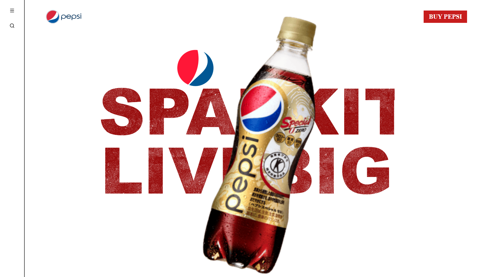
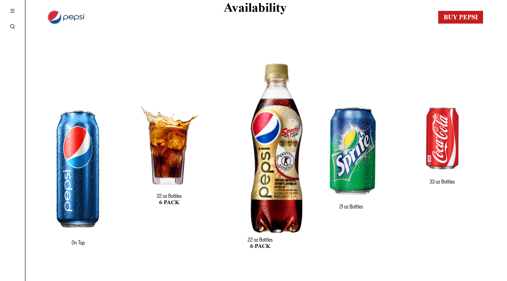

# Pepsi Landing Page

A modern, responsive landing page for Pepsi built with HTML, CSS, and JavaScript.

## 🚀 Features

- Responsive design that works on all devices
- Modern and sleek UI
- Smooth animations and transitions
- Interactive elements
- Optimized performance

## 📸 Preview




## 🛠️ Technologies Used

- HTML5
- CSS3
- JavaScript
- Modern CSS features (Flexbox, Grid)
- Responsive design principles

## 📦 Installation

1. Clone the repository:
```bash
git clone https://github.com/yourusername/pepsi-landing-page.git
```

2. Navigate to the project directory:
```bash
cd pepsi-landing-page
```

3. Open `index.html` in your browser or use a local server.

## 🎨 Design

The landing page features a modern design with:
- Clean and minimal layout
- Pepsi brand colors
- Smooth scrolling
- Interactive elements
- Mobile-first approach

## 🤝 Contributing

Contributions are welcome! Please feel free to submit a Pull Request.

## 📄 License

This project is licensed under the MIT License - see the [LICENSE](LICENSE) file for details.

## 📞 Contact

For any inquiries, please reach out to [your-email@example.com](mailto:your-email@example.com) 